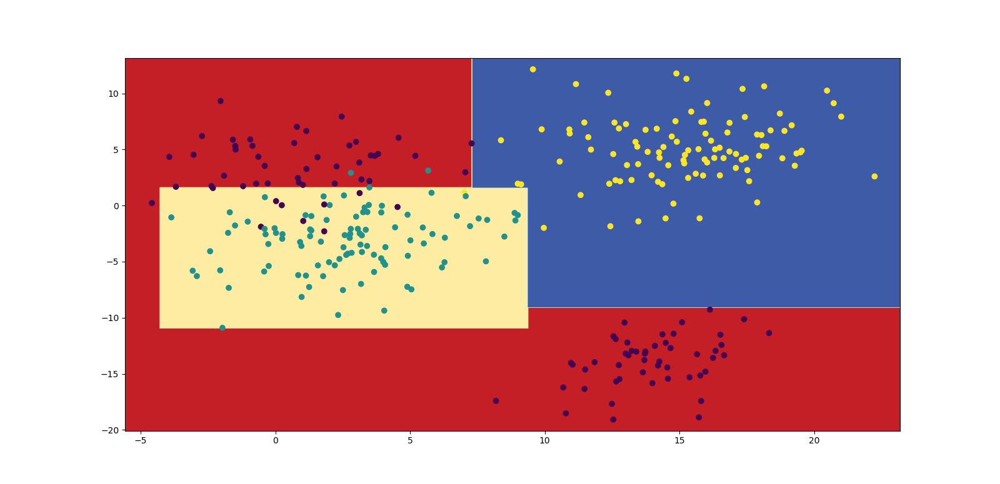

# simple_decision_tree
Implementation of decision from scratch

## Testing
run unit tests
```
python -m pytest
```
After that you can try to run `plot_results.py` script
```
python plot_results.py
```


